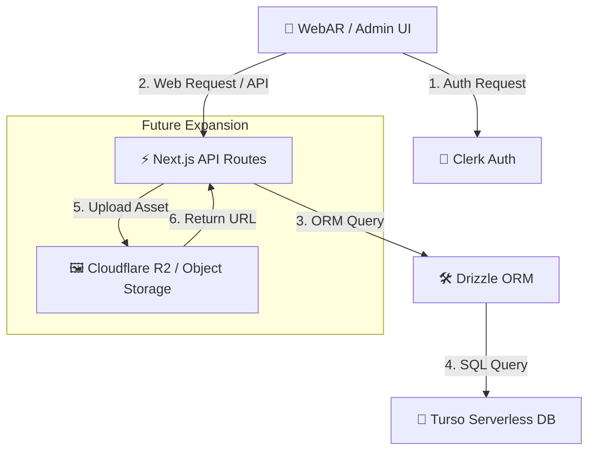

# 🏗️ Full-Stack AR Navigation Architecture

เอกสารนี้อธิบายสถาปัตยกรรมระบบ (System Architecture) ของโครงการ **AR In-Store Navigation Platform** ซึ่งถูกออกแบบมาให้เป็นระบบ Full-Stack ที่ยืดหยุ่น รองรับการขยายตัว ไม่มีปัญหาเรื่องการหยุดทำงานชั่วคราว (No Sleep/No Cold Start) และใช้งานฟรี 100% ในช่วงเริ่มต้น

---

## 1. The Core Stack (แกนหลักของระบบ)

### 💾 Database: **Turso (libSQL / SQLite)**
- **หน้าที่:** เก็บข้อมูลพิกัดร้านค้า, เส้นทางการเดิน (Waypoints & Edges), ข้อมูลปลายทาง (Destinations), และข้อมูลร้านค้าต่างๆ
- **ทำไมต้องเลือก:** 
  - ทำงานบน Edge/Serverless ได้เร็วที่สุด (Cold start ใกล้เคียง 0 วินาที)
  - **ไม่มีระบบ Sleep** เหมือน Supabase (พร้อมใช้งานตลอด 24 ชม.)
  - Free Tier ใจดีมาก (8 GB storage / 500 Databases)

### 🛠️ ORM: **Drizzle ORM**
- **หน้าที่:** เป็นตัวเชื่อมต่อและควบคุม Database (SQL) ในรูปแบบ TypeScript Type-safe
- **ทำไมต้องเลือก:** 
  - เบาและเร็วกว่า Prisma มาก เหมาะกับ Edge Runtime
  - เขียนตารางแบบ TypeScript ทำให้ไม่ต้องกลัวพิมพ์ชื่อฟิลด์สะกดผิด
  - มีระบบ Migration ที่ทำงานได้รวดเร็วและปลอดภัย

### 🔑 Authentication: **Clerk**
- **หน้าที่:** ระบบล็อกอินสำหรับผู้ดูแลระบบ (Admin) เพื่อเข้าจัดการแผนที่ห้าง
- **ทำไมต้องเลือก:**
  - ติดตั้งง่ายใน 5 นาที มีปุ่มและหน้าต่างสำเร็จรูปให้ดึงมาแปะโดยไม่ต้องเขียน UI เอง
  - จัดการความปลอดภัยระดับสูง (MFA, Email Verification, Google Login) ให้ฟรี
  - Free Tier รองรับ 10,000 Active Users/เดือน

---

## 2. Future Plug-and-Play (การต่อประสานในอนาคต)

สถาปัตยกรรมนี้ถูกออกแบบมาในลักษณะ **Modular (เสียบปลั๊กเสริมได้ทันที)** โดยไม่กระทบกับโครงสร้างหลัก:

### 🖼️ การเก็บรูปภาพและโมเดล 3D (.glb)
- เมื่อระบบโตขึ้นและต้องการให้ Admin อัปโหลดไฟล์ 3D เองได้ เราจะเสียบ **Cloudflare R2** (หรือ **Vercel Blob**) เข้ามา
- **โลจิกการทำงาน:**
  1. Admin อัปโหลดไฟล์โมเดลผ่านหน้าเว็บ Next.js API
  2. Next.js อัปโหลดไฟล์นั้นไปเก็บที่ **Cloudflare R2**
  3. Cloudflare R2 ส่ง URL ลิงก์ตรงกลับมา (เช่น `https://r2.my-store/model.glb`)
  4. เราบันทึก URL ตัวนี้ลงใน **Turso Database** คู่กับ Waypoint นั้นๆ

---

## 3. Data Flow (ทิศทางของข้อมูล)

### 📲 ฝั่งผู้ใช้ทั่วไป (AR Navigation)
1. สแกน QR Code เพื่อเปิดเว็บ Next.js (Client Component)
2. หน้าเว็บดึงไฟล์ข้อมูลห้างจาก API Route (`/api/store?id=xxx`)
3. Next.js API ไปดึงข้อมูลพิกัด (Waypoints/Edges) ล่าสุดจาก **Turso DB** ผ่าน **Drizzle ORM**
4. ข้อมูลถูกส่งกลับมาคำนวณเส้นทาง A* และวาดลูกศร 3D ด้วย Three.js บนหน้าจอมือถือทันที

### 👤 ฝั่งผู้ดูแลระบบ (Admin Platform)
1. ล็อกอินผ่าน **Clerk** เพื่อเข้าสู่สิทธิ์แอดมิน
2. จัดการแก้ไขจุด Waypoint, ลากเส้นทาง Edges เพิ่ม หรือแก้ไขพิกัดร้านค้าผ่านระบบแผนที่ 2D/3D
3. บันทึกข้อมูลกลับไปที่ Next.js API (ระบบตรวจความปลอดภัยของ Token ผ่าน Clerk Middleware)
4. อัปเดตข้อมูลลง **Turso DB** ทันที
